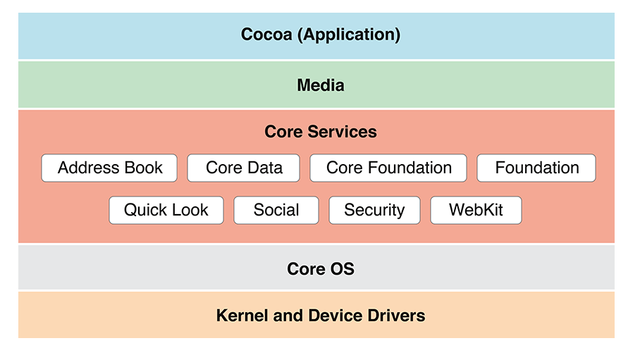
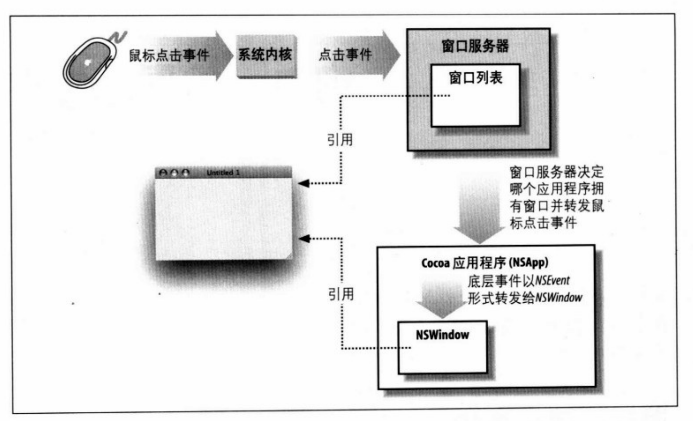
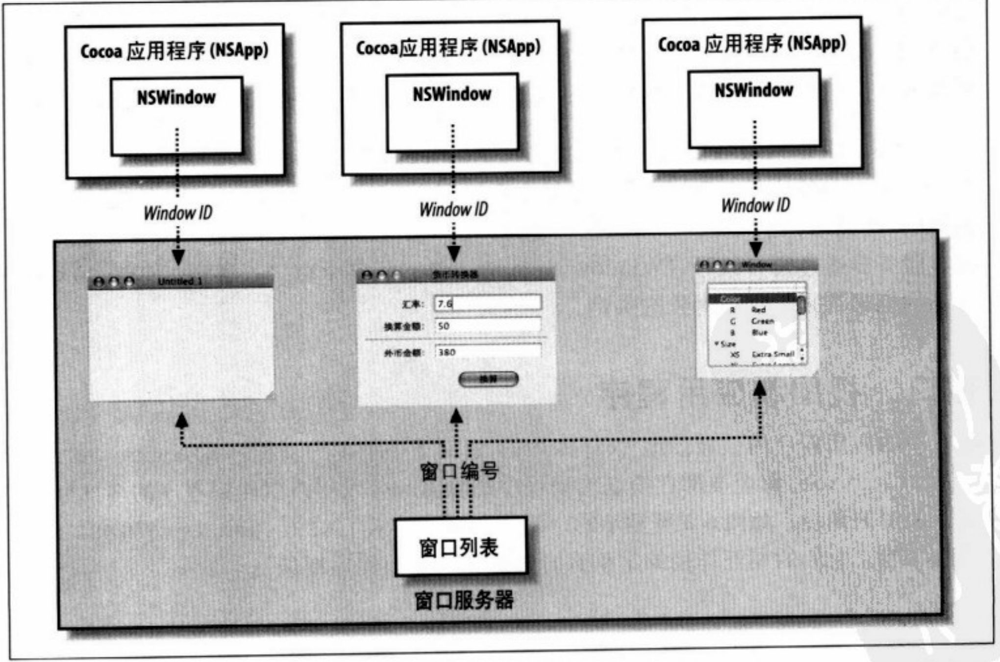
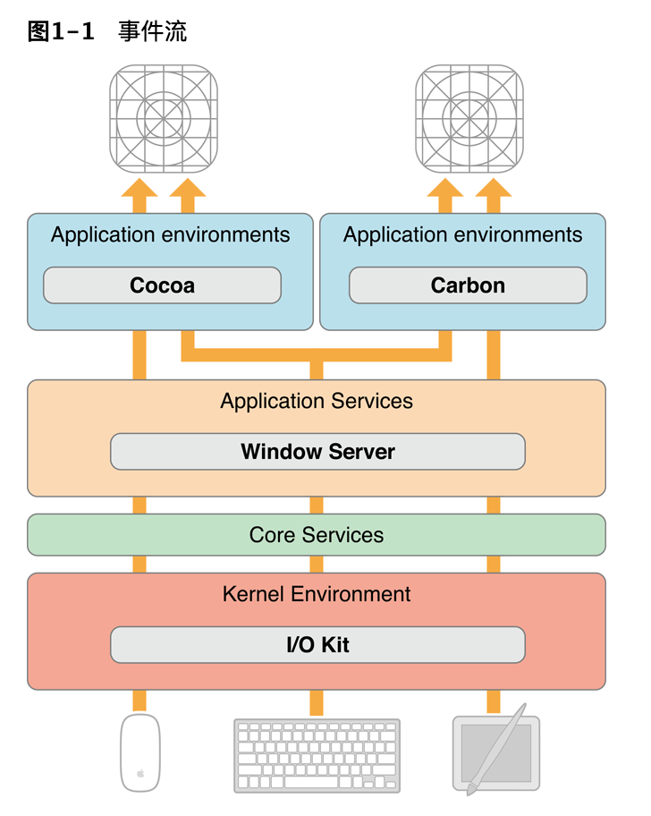
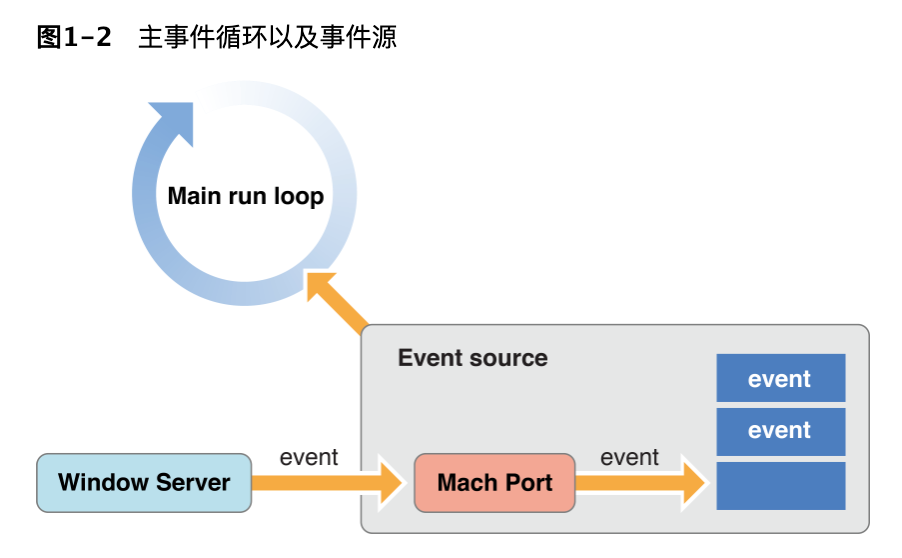
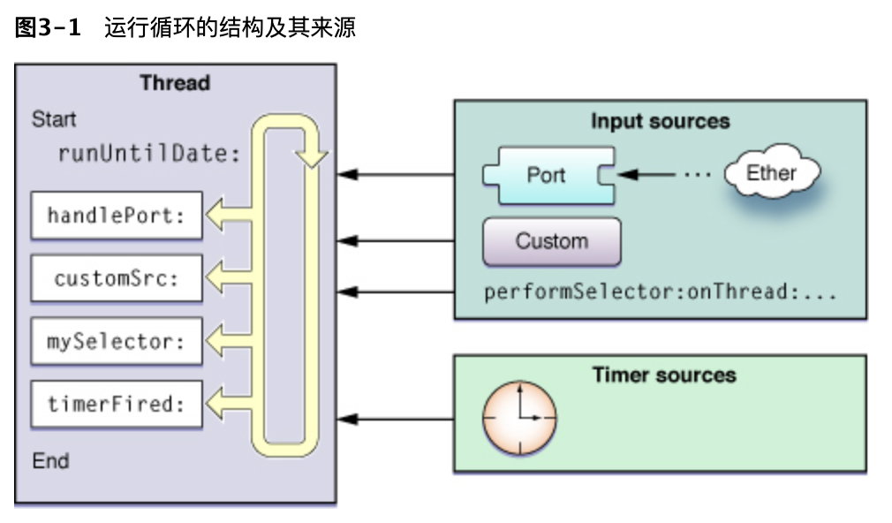
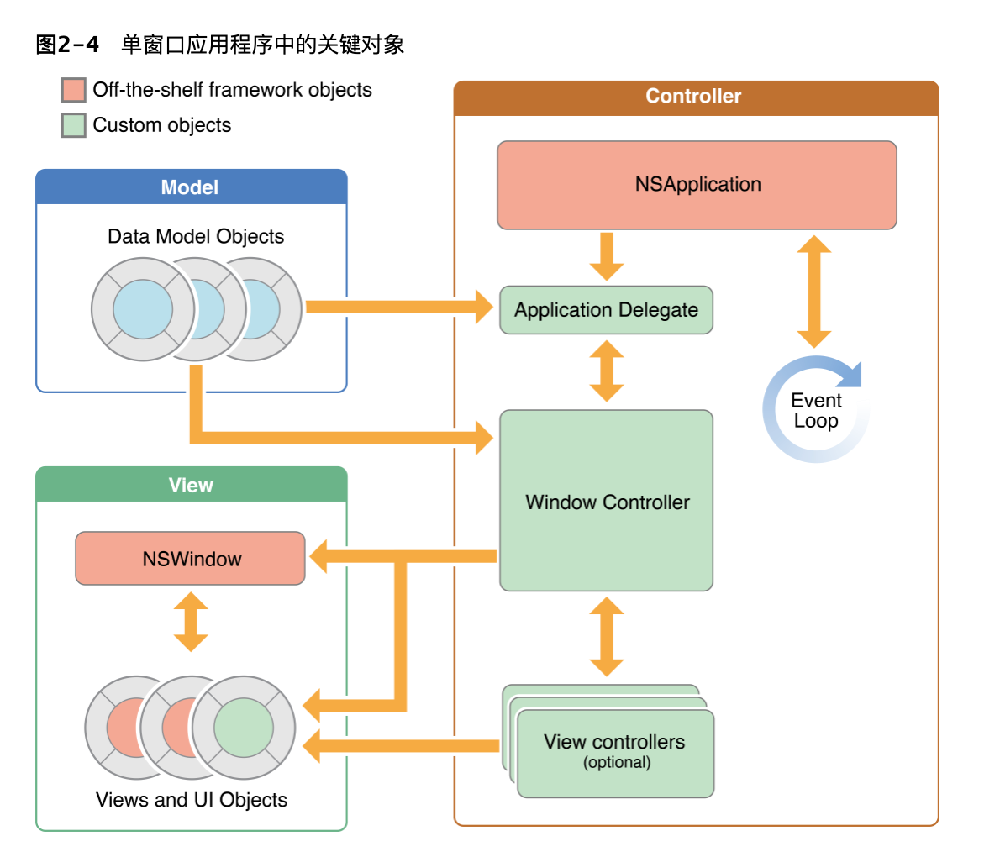

Cocoa：窗口系统和事件循环
# Cocoa层次结构


Cocoa框架导入了用于应用程序开发的核心Objective-C框架：AppKit，Foundation和Core Data。

- AppKit

    这是这三个框架中唯一存在于Cocoa层中的框架。AppKit是Cocoa应用程序的关键框架。AppKit框架中的类实现了应用程序的用户界面（UI），包括窗口，对话框，控件，菜单，绘图和事件处理。它们还处理行为良好的应用程序所需的许多行为，包括菜单管理，窗口管理，文档管理等。详情参见[AppKit](https://developer.apple.com/library/archive/documentation/MacOSX/Conceptual/OSX_Technology_Overview/CocoaApplicationLayer/CocoaApplicationLayer.html#//apple_ref/doc/uid/TP40001067-CH274-SW6)。

- Foundation

    Foundation框架的类（位于Core Services层中）实现数据管理，文件访问，流程通知，网络通信和其他低级功能。Foundation框架定义了一些基础类，可以用于各种类型的Cocoa程序。Foundation框架和AppKit框架的区分标准在于用户界面。如果一个对象既不出现在用户界面上，也不是专门用于支持用户界面，那么它就属于Foundation框架。您可以仅用Foundation框架创建一个Cocoa程序，而不涉及其它框架；命令行工具和Internet服务器就是这样的例子。AppKit直接依赖于Foundation，因为它的许多方法和函数要么将Foundation类的实例作为参数，要么将实例作为值返回。
    详情参见[Foundation](https://developer.apple.com/library/archive/documentation/MacOSX/Conceptual/OSX_Technology_Overview/CoreServicesLayer/CoreServicesLayer.html#//apple_ref/doc/uid/TP40001067-CH270-SW4)

- CoreData

    Core Data框架的类（也位于Core Services层中）基于Model-View-Controller设计模式来管理应用程序的数据模型。尽管Core Data对于应用程序开发是可选的，但建议将其用于处理大型数据集的应用程序。
    详情参见[CoreData](https://developer.apple.com/library/archive/documentation/MacOSX/Conceptual/OSX_Technology_Overview/CoreServicesLayer/CoreServicesLayer.html#//apple_ref/doc/uid/TP40001067-CH270-BAJGDBBH)

# 窗口系统
window server


MacOS的Cocoa窗口由两个相交互的系统创建并管理，窗口服务器（Window Server）创建窗口并显示在屏幕上。窗口服务器是一个进程,它使用Quanz(系统底层的绘图系统)来绘制窗口、改变窗口尺寸、隐藏和移动窗口。窗口服务器还会检测用户事件(比如鼠标点击或者键盘按键)并把它们发送给应用程序。

window server和nswindow


窗口服务器创建的窗口与由AppKit框架支持的对象相配对,该对象是Nswindow类的实例。Cocoa程序中每个窗口都由Nswindow或其子类的实例来管理。当NsWindow对象创建时，窗口服务器便创建一个受管理的实际窗口。窗口服务器通过窗口编号(windowNumber)来引用某个窗口。

# 事件系统
# 事件如何进入Cocoa应用程序


鼠标/键盘-IO驱动-Window Server事件队列-目标应用程序主RunLoop

详情参见[Cocoa事件架构](https://developer.apple.com/library/archive/documentation/Cocoa/Conceptual/EventOverview/EventArchitecture/EventArchitecture.html#//apple_ref/doc/uid/10000060i-CH3-SW11)

# 应用程序主RunLoop


每个应用程序都有特定于其环境的机制，用于从窗口服务器接收事件。对于Cocoa应用程序，该机制称为主事件循环。RunLoop（在Cocoa中是一个NSRunLoop对象）使应用程序能够从各种来源接收输入。默认情况下，OS X中的每个线程都有其自己的RunLoop，并且Cocoa应用程序主线程的RunLoop称为主事件循环。与主要事件循环相关的还有称为事件源的输入源，该事件源是在初始化全局NSApplication对象（NSApp）时构造的。事件源包括一个用于从窗口服务器接收事件的端口和一个FIFO队列（事件队列），该FIFO队列用于保留这些事件，直到应用程序可以处理它们为止。

详情参见[Cocoa事件架构](https://developer.apple.com/library/archive/documentation/Cocoa/Conceptual/EventOverview/EventArchitecture/EventArchitecture.html#//apple_ref/doc/uid/10000060i-CH3-SW11)

# RunLoop


RunLoop非常像其名称听起来。这是您的线程进入的一个循环，用于响应传入事件而运行事件处理程序。您的代码提供了用于实现运行循环的实际循环部分的控制语句（换句话说，您的代码提供了驱动运行循环的while/for循环）。在循环内，您可以使用运行循环对象来“运行”事件处理代码，以接收事件并调用已安装的处理程序。

RunLoop从两种不同类型的源接收事件。输入源传递异步事件，通常是来自另一个线程或其他应用程序的消息。计时器源传递同步事件，这些事件在计划的时间或重复的间隔发生。两种类型的源都使用特定于应用程序的处理程序例程来处理事件到达时的事件。

输入源将异步事件传递给相应的处理程序，并导致runUntilDate:方法（在线程的关联NSRunLoop对象上调用）退出。计时器源将事件传递到其处理程序例程，但不会导致运行循环退出。

除了处理输入源之外，运行循环还生成有关运行循环行为的通知。注册的运行循环观察者可以接收这些通知，并使用它们在线程上进行其他处理。您可以使用Core Foundation在线程上安装运行循环观察器。

详情参见[RunLoop](https://developer.apple.com/library/archive/documentation/Cocoa/Conceptual/Multithreading/RunLoopManagement/RunLoopManagement.html#//apple_ref/doc/uid/10000057i-CH16-SW1)

[深入理解RunLoop](https://blog.ibireme.com/2015/05/18/runloop/)

# Cocoa单窗口应用核心对象


- NSApplication

    （必需）运行事件循环并管理应用程序和系统之间的交互。您通常按NSApplication原样使用该类，将任何与应用程序对象相关的自定义代码放入您的应用程序委托对象。

- Application Delegate

    （预期）您提供的自定义对象，该NSApplication对象与该对象紧密配合以运行应用程序并管理不同应用程序状态之间的转换。

    您的Application Delegate对象必须实现NSApplicationDelegate Protocol。

- Model

    存储特定于您的应用程序的内容。银行应用程序可能存储包含金融交易的数据库，而绘画应用程序可能存储图像对象或导致创建该图像的绘图命令序列。

- Window Controller

    分别负责加载和管理单个窗口，并与系统协调以处理标准的窗口行为。

    您可以子类化NSWindowController地管理窗口及其内容。每个窗口控制器负责其窗口中发生的所有事情。如果窗口的内容很简单，则窗口控制器可以自行进行所有管理。如果您的窗口更复杂，则窗口控制器可能会使用一个或多个视图控制器来管理窗口的各个部分。

- NSWindow

    代表您的屏幕窗口，根据您的应用程序的需求以不同的样式进行配置。例如，大多数窗口都有标题栏和边框，但是您也可以配置没有这些视觉装饰的窗口。窗口对象几乎总是由窗口控制器管理。

    应用程序还可以具有辅助窗口，也称为对话框和面板。这些窗口从属于当前文档窗口，如果是单窗口应用程序，则属于主窗口。它们支持文档或主窗口，例如，允许选择字体和颜色，允许从调色板中选择工具或显示警告。辅助窗口通常是模式窗口。

- View Controller

    协调将单个视图层次结构加载到您的应用程序中。使用视图控制器来划分管理更复杂的窗口布局的工作。您的视图控制器（与窗口控制器）一起工作以显示窗口内容。

    如果您已经开发了iOS应用程序，请注意AppKit视图控制器的作用不如UIKit视图控制器重要。在OS X中，AppKit视图控制器是窗口控制器的助手，窗口控制器最终负责窗口中的所有操作。AppKit视图控制器的主要工作是加载其视图层次结构。其他所有内容都是您编写的自定义代码。

- View Widget

    在窗口中定义一个矩形区域，绘制该区域的内容，并处理该区域中的事件。视图可以彼此叠加以创建视图层次结构，从而使一个视图遮盖了基础视图的一部分。

- UI Object

    代表标准系统控件。这些视图子类提供了可用于构建用户界面的标准可视项，例如按钮，文本字段和表格。尽管按原样使用了一些控件来呈现视觉装饰，但大多数控件都与您的代码一起使用来管理用户与应用程序内容的交互。


# 和Windows的区别
- Windows

    Windows中线程分为UI线程和工作线程，UI线程带有一个消息队列，工作线程没有消息队列，如果工作线程中创建了UI（例如一个窗口），那么系统为它创建消息队列，成为UI线程。

    窗口和线程是绑定的，窗口到消息只会派发到创建它的那个线程的消息队列，所以如果你在子线程创建了窗口，但是没有执行消息循环（while(GetMessage){}）,你不会看到这个窗口，它连paint消息都收不到。

- Cocoa

    Cocoa每个线程都有RunLoop，但它们不用于处理用户事件，苹果建议，所有用户事件都在主线程处理，并按需要派发到子线程。
    苹果强制UIKit非线程安全，所有UI相关操作必须在主线程，否则crash。- 参考[Cocoa线程安全摘要](https://developer.apple.com/library/archive/documentation/Cocoa/Conceptual/Multithreading/ThreadSafetySummary/ThreadSafetySummary.html#//apple_ref/doc/uid/10000057i-CH12-SW1)

    从苹果的角度来看，不让UIKit成为线程安全是一个有意识的设计决定。使其成为线程安全的，就性能而言并不会给您带来太多好处。实际上，这会使许多事情变慢。UIKit与主线程绑定的事实使得编写并发程序和使用UIKit非常容易。您要做的就是确保始终在主线程上进行对UIKit的调用。

    有些情况我们需要在子线程创建UI，其实没有必要，OC/Cocoa都提供了很多机制方便在子线程中派发任务到主线程执行：

    - GCD [细说GCD（Grand Central Dispatch）如何用](https://github.com/ming1016/study/wiki/%E7%BB%86%E8%AF%B4GCD%EF%BC%88Grand-Central-Dispatch%EF%BC%89%E5%A6%82%E4%BD%95%E7%94%A8)

    基于队列的并发编程API,主线程中有一个系统标准队列，main queue，所以子线程中派发任务到主线程非常简单：
    ```
    dispatch_sync(dispatch_get_main_queue(), ^{
        //some code on main thread
    
    });
    ```
    - NSObject提供的
    ```
    [self performSelectorOnMainThread:@selector(RefreshCellForLiveId:)
                            withObject:nil
                            waitUntilDone:YES];
    ```